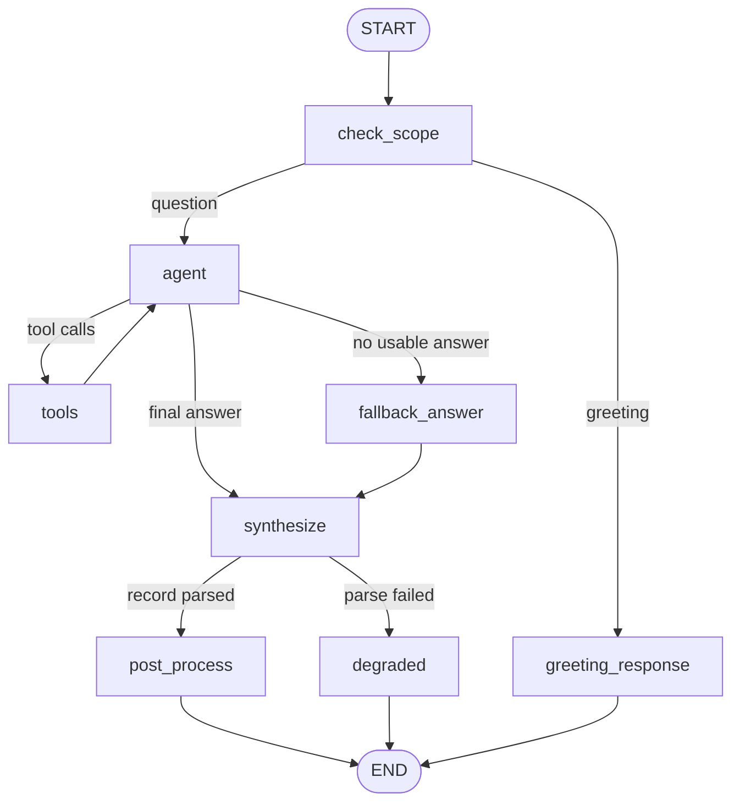

# Private Docs Assistant

A private, local assistant for everyday people. Ask a question in plain language and get a clear, direct answer — with crisp next steps and, when the answer comes from your files, a list of the documents it used.

Built for **privacy first**: it runs entirely on a **local [Ollama](https://ollama.com) model**. There are **no API keys, no third-party servers, and no external network calls** — your questions and documents never leave your machine. Because the models are open-source and run locally, there are **no per-request API costs**.

**What it's for:** quick answers to any question, and getting information out of your own personal documents (notes, contracts, statements, policies, reports, manuals, and so on) without uploading them anywhere.

It is built as an **agentic RAG** system: a tool-calling LangGraph agent answers your question and decides when to search your uploaded documents, then a short synthesis pass distils the answer into next steps.

## Prerequisites

Install and start [Ollama](https://ollama.com), then pull the models. The chat model **must support tool calling** for the agentic-RAG flow:

```bash
ollama pull llama3.2:3b        # small, fast, tool-capable chat model (~2 GB)
ollama pull nomic-embed-text   # embedding model (~274 MB, runs on CPU)
```

Larger tool-capable models trade speed for quality (e.g. `llama3.1:8b`, `qwen2.5:7b`, `mistral-nemo`); set your choice via `APP_LLM__MODEL` or `config/settings.yaml`. Avoid non-tool models such as `gemma*` — they cannot drive the agent and may echo the prompt. On models without tool support the app still works via a deterministic retrieval fallback.

## Quick start

```bash
uv sync
uv run streamlit run streamlit_app.py
```

Local FastAPI:

```bash
uv run advisory               # http://localhost:8000/docs
```

There is no built-in content to seed — the assistant answers from general knowledge and from the documents you upload yourself.

> **Note:** the Chroma collection is configured for **cosine** similarity (matching `nomic-embed-text`). If you are upgrading from an older build, delete any existing `data/chroma` directory so the collection is recreated with the correct distance metric.

### Streamlit chat UI

The UI is a **multi-turn chat** ([`streamlit_app.py`](streamlit_app.py)):

- **Streaming answers** — the reply streams token-by-token as it is generated.
- **Rich output** — each reply renders the answer, a **Recommended next steps** bullet list, any **clarifying questions** when more detail is needed, a **Sources** list citing the documents used, and an *Answered in Xs* footer.
- **Document grounding** — upload PDF/DOCX/TXT in the sidebar; uploads are scoped to your session and searched by the assistant when relevant. A `client_id` can additionally be set to share documents across your sessions.
- Local chat history can be saved, loaded, and deleted from the sidebar.
- No API key required — everything runs on your machine via Ollama.

## Architecture

Processing is orchestrated by a **LangGraph** `StateGraph` ([`advisory_graph.py`](src/graph/advisory_graph.py)). The outer [`AdvisoryService`](src/services/advisory.py) applies a circuit breaker and times the run before invoking the graph; it also exposes a streaming variant for the UI.



### Agentic RAG and tools

The **agent** is `ChatOllama(...).bind_tools([...])` invoked over the conversation in graph state. It answers the question and decides when to retrieve, looping with the **tools** node (`langgraph.prebuilt.ToolNode` + a custom router that caps the loop at `agent.max_tool_iterations`). One real LangChain tool ([`src/rag/tools.py`](src/rag/tools.py)) is exposed:

| Tool | Purpose |
|---|---|
| `search_uploaded_documents` | Search the user's own uploaded documents, scoped to the current session/client via `InjectedState` (the model never supplies the ids). |

The tool records the passages it returns into state so the final response can cite them. If the agent errors or returns no usable answer (e.g. a weak/non-tool model), the **`fallback_answer`** node performs a deterministic retrieval plus a single non-tool generation so the app still produces a reply.

### Graph state (`AdvisoryState`)

| Field | Purpose |
|---|---|
| `request` | Incoming `AdvisoryRequest` |
| `trace_id` | Request correlation id for logging |
| `messages` | Tool-calling conversation (agent replies + tool results) |
| `grounding_sources` | Sources accumulated from tool calls, used for citations |
| `agent_steps` | Agent turn counter that caps the tool loop |
| `answer` | The grounded free-text answer |
| `grounding` | Cited retrieval sources attached to the response |
| `scope_result` | Conversational intake outcome (greeting vs question) |
| `llm_result` | Synthesis parse outcome (`LLMResult`) |
| `response` | Final `AdvisoryResponse` written by whichever terminal node fires |
| `errors` | Accumulated error strings for debugging |

### Nodes

| Node | Responsibility |
|---|---|
| `check_scope` | Conversational intake: detects a plain greeting so the UI can welcome the user; everything else proceeds to the agent |
| `agent` | Tool-calling `ChatOllama` agent that answers the question and decides when to retrieve |
| `tools` | Executes `search_uploaded_documents` and records cited sources |
| `fallback_answer` | Deterministic retrieve + single non-tool generation when the agent yields no answer |
| `synthesize` | Distils the answer into the structured record (next steps, clarifying questions) |
| `post_process` | Builds the response, marking it `needs_clarification` when the model asked for more detail |
| `degraded` | Safe fallback when synthesis cannot be parsed (keeps the answer if one was produced) |
| `greeting_response` | Welcome message inviting the user to ask a question or upload documents |

## Stack

| Layer | Technology |
|---|---|
| UI | Streamlit (streaming responses) |
| API | FastAPI (async) |
| Config | Dynaconf + [`config/settings.yaml`](config/settings.yaml) |
| Orchestration | LangGraph (`ToolNode` agentic-RAG loop) |
| Agent / LLM | Ollama via `langchain-ollama` `ChatOllama` (tool-capable, e.g. `llama3.2:3b`) — local, no API key |
| Structured output | Ollama structured JSON (`format=schema.model_json_schema()`) |
| Embeddings | Ollama (`nomic-embed-text:latest`) — local, CPU-capable, cosine |
| RAG | LangChain tool + `langchain-chroma` |
| Resilience | tenacity, circuit breaker, deterministic fallback + degraded nodes |
| Logging | loguru |

## API (local FastAPI)

| Method | Path | Description |
|---|---|---|
| GET | `/health` | Health and LLM availability |
| POST | `/api/v1/advise` | Grounded answer + next steps |
| POST | `/api/v1/documents/ingest` | Upload PDF/DOCX/TXT for retrieval |
| GET | `/api/v1/documents/{id}/status` | Ingestion status |

The `/advise` response includes the grounded `answer`, a `recommendations` bullet list, any `clarification_questions`, cited `grounding` sources, and `elapsed_seconds`.

```bash
curl -s -X POST http://localhost:8000/api/v1/advise \
  -H 'Content-Type: multipart/form-data' \
  -F 'problem_description=What is the renewal date in my lease?' \
  -F 'session_id=' \
  -F 'client_id=' | jq
```

Interactive schema: http://localhost:8000/docs

## Hard cases

| Condition | Behavior | HTTP | `status` |
|---|---|---|---|
| Vague / under-specified question | Clarifying questions | 200 | `needs_clarification` |
| Agent yields no answer | Deterministic retrieval fallback | 200 | `success` |
| Synthesis parse failure | Degraded response (answer kept if present) | 200 | `degraded` |
| Ollama down / overloaded | Retries + circuit breaker | 503 | `unavailable` |

## Configuration

Non-secret settings live in [`config/settings.yaml`](config/settings.yaml) and are loaded by **Dynaconf**.

Notable settings:

| Setting | Purpose |
|---|---|
| `llm.model` | Tool-capable chat model served by Ollama |
| `agent.max_tool_iterations` | Caps the agent's tool-calling loop |
| `rag.similarity_threshold` | Cosine relevance cutoff (`1 - cosine_distance`) |

**Environment profiles** (`ENV_FOR_DYNACONF`):

| Profile | Use |
|---|---|
| `default` | Local development |
| `streamlit` | Streamlit app (ephemeral Chroma) |
| `testing` | Pytest |

Override any YAML value with `APP_*` env vars (nested keys use `__`, e.g. `APP_LLM__MODEL=qwen2.5:7b`).

## Development

```bash
uv run ruff check .
uv run mypy
uv run pytest
```

Regenerate [`requirements.txt`](requirements.txt) after dependency changes:

```bash
uv export --no-dev --format requirements-txt -o requirements.txt
```
